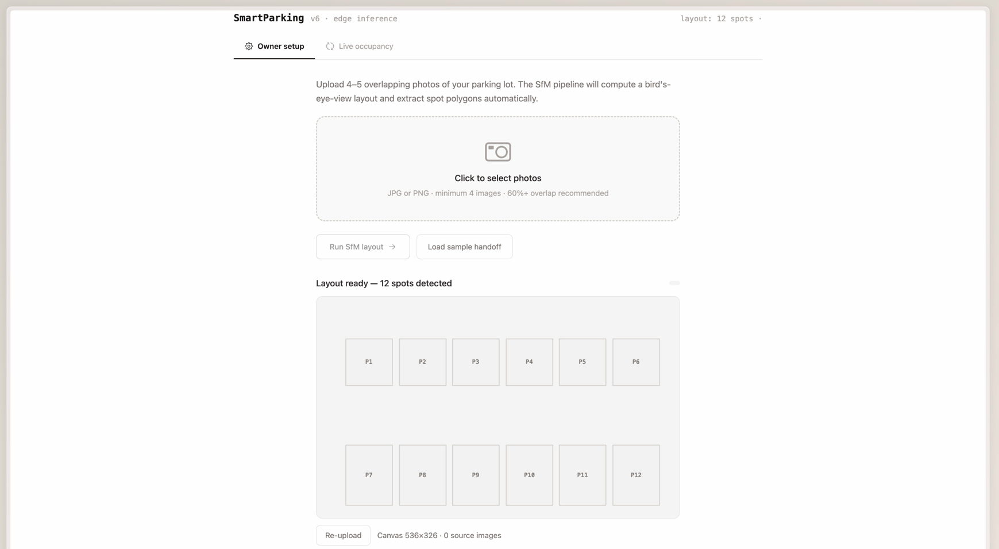
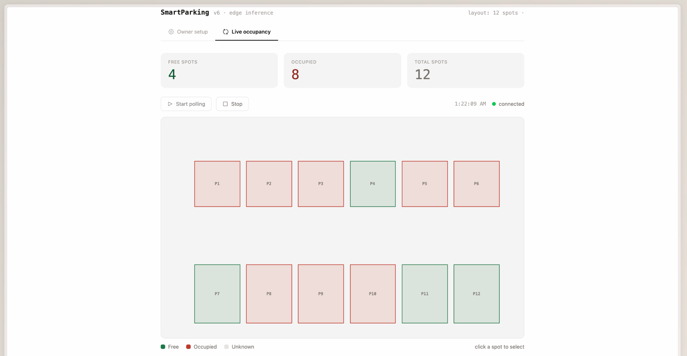
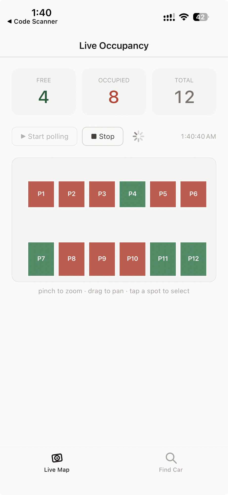
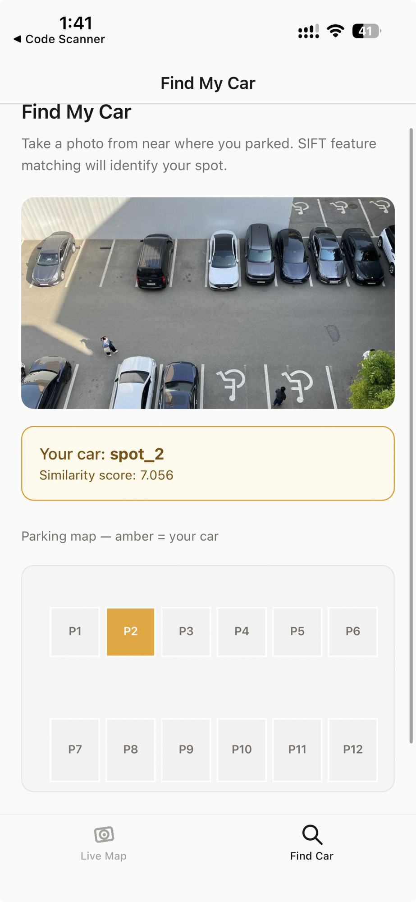

# Smart Parking System

> Edge-based parking occupancy detection with a two-stage vision pipeline, a FastAPI backend, and web + mobile apps — including a photo-based **Find My Car** feature.

Smart Parking System detects whether each parking space is **occupied** or **free** from a single overhead camera, entirely on the edge device. Instead of streaming raw video, the edge node sends a few hundred bytes of JSON to the backend — a ~99.9% bandwidth reduction versus H.264 video. The promoted classifier (`YOLOv8n-cls`, 2.83 MB) reaches **97.72% accuracy** on the held-out, unseen-lot ACPDS test split while being ~9× smaller than the dataset paper's ResNet50 baseline.

The canonical architecture reference lives in [`docs/architecture.md`](docs/architecture.md).

---

## Features

- **Two-stage occupancy detection** — parking-space quadrilaterals → perspective warp → `YOLOv8-cls` → temporal smoothing.
- **Edge-first** — only compact occupancy JSON leaves the device; raw video stays local.
- **Owner setup (web)** — upload lot photos, run Structure-from-Motion server-side to build a bird's-eye map and extract spot polygons, then correct spot labels inline.
- **Live occupancy map (web + mobile)** — real-time green/red spot coloring with free/occupied/total counts.
- **Find My Car (mobile)** — match a driver's photo to a parking spot with SIFT + FLANN + RANSAC; manage per-spot reference photos through the API.
- **Optional auth** — opt-in bearer-token authentication that protects owner routes and scopes Find My Car sessions to their owner.
- **Reproducible ML** — `make` targets for dataset extraction, training, evaluation, export (ONNX / Core ML INT8), and benchmarking.

---

## Architecture

```
parking-space quadrilaterals → perspective warp → YOLOv8-cls → temporal smoothing → JSON → FastAPI
```

- **Stage 1** loads parking-space quadrilaterals from `ACPDS` annotations (or SfM-generated layouts for new cameras).
- **Stage 2** classifies each perspective-corrected `128×128` patch as `occupied` or `free`.
- The same published layout drives the edge runtime, the web map, and the mobile map, so all three stay consistent by construction.

| Platform | Owner Setup | Live Occupancy Map | Find My Car |
| -------- | ----------- | ------------------ | ----------- |
| Web      | ✅          | ✅                 | —           |
| Mobile   | —           | ✅                 | ✅          |

The web map renders spot quadrilaterals at exact image coordinates with Leaflet; the mobile map uses coordinate-accurate SVG polygons with pinch-to-zoom and pan (`react-native-svg` + `react-native-gesture-handler`).

---

## Screenshots

| Owner setup (web) | Live occupancy (web) |
| --- | --- |
|  |  |

| Live occupancy (mobile) | Find My Car (mobile) |
| --- | --- |
|  |  |

---

## Results

Stage 2 classifier on the ACPDS splits. `yolov8n_stage2` is the promoted checkpoint.

| Model          | Split    | Accuracy   | Precision | Recall | F1     | Size (MB) |
| -------------- | -------- | ---------- | --------- | ------ | ------ | --------- |
| yolov8n_stage2 | Val      | 0.9827     | 0.9784    | 0.9819 | 0.9802 | 2.83      |
| yolov8s_stage2 | Val      | 0.9816     | 0.9727    | 0.9856 | 0.9791 | 9.78      |
| yolov8m_stage2 | Val      | 0.9795     | 0.9670    | 0.9868 | 0.9768 | 30.22     |
| yolov8n_stage2 | **Test** | **0.9772** | 0.9864    | 0.9570 | 0.9715 | **2.83**  |
| yolov8s_stage2 | Test     | 0.9691     | 0.9745    | 0.9488 | 0.9615 | 9.78      |
| yolov8m_stage2 | Test     | 0.9738     | 0.9846    | 0.9504 | 0.9672 | 30.22     |

Larger variants did not improve test accuracy — the bottleneck is patch quality (partial vehicles, border artifacts after warp, label ambiguity), not model capacity. Quadrilateral warp pooling beats a bounding-square crop by +1.34 pp test accuracy. Inference runs at 155–858 FPS across PyTorch / ONNX / Core ML INT8 backends. See [`docs/edge_benchmarks.md`](docs/edge_benchmarks.md) for the full benchmark breakdown.

---

## Tech stack

- **ML / edge:** Python, Ultralytics YOLOv8, OpenCV, ONNX Runtime, Core ML
- **Backend:** FastAPI, SQLite
- **Web:** Vite + React, Leaflet, Tailwind CSS
- **Mobile:** React Native (Expo), `react-native-svg`, `react-native-gesture-handler`

---

## Repository structure

```
edge/        Edge inference pipeline (detect.py) and soak tests
backend/     FastAPI app, SQLite schema, API (see backend/README.md)
frontend/    React web app (src/) and React Native mobile app (mobile/)
ml/          Training, evaluation, export, SfM layout, localization scripts
docs/        Architecture, diagrams, runbooks
samples/     Sample images and localization references
outputs/     UI screenshots used in docs
tests/       Backend, edge, and ML tests
scripts/     End-to-end smoke test
```

---

## Getting started

### Prerequisites

- Python 3.9+
- Node.js 18+ (for the web and mobile apps)

### Install

```bash
python3 -m venv .venv
source .venv/bin/activate
python -m pip install --upgrade pip
pip install -r requirements.txt
```

Or with `make`:

```bash
make install        # runtime deps
make install-dev    # + dev/test deps
```

Verify the environment:

```bash
python -c "import cv2, ultralytics, yaml; print('env ok')"
```

### Model weights

Trained weights are **not** committed to git — they are published as
[GitHub Release](https://github.com/thebkht/smart-parking-system/releases)
assets. Fetch the promoted Stage 2 classifier into `acpds_cls/weights/`:

```bash
make fetch-weights
# or pick a release tag / extra assets:
RELEASE_TAG=v1.0.0 ASSETS="best.pt best.onnx best_int8.onnx" bash scripts/fetch_weights.sh
```

The edge runtime and `ml/` scripts default to `acpds_cls/weights/best.pt`
(`STAGE2_WEIGHTS` in the `Makefile`). See [`MODEL_LICENSE.md`](MODEL_LICENSE.md)
for redistribution terms.

---

## Usage

### Backend

```bash
make backend        # uvicorn on 0.0.0.0:8000 (API docs at /docs)
```

### Edge inference

```bash
make edge EDGE_ARGS="--image 'samples/photo_2026-04-23 21.29.16.jpeg'"
make edge EDGE_ARGS="--camera 0"          # live camera
make edge EDGE_ARGS="--image <path> --post"   # also POST to the backend
```

### Web app

```bash
cd frontend
npm install
npm run dev
```

### Mobile app (Expo)

```bash
cd frontend
npm install
npx expo start
```

See [`frontend/README.md`](frontend/README.md) for screen descriptions and device setup.

---

## API overview

Full reference: [`backend/README.md`](backend/README.md). Key endpoints:

| Method | Route | Purpose |
| ------ | ----- | ------- |
| `POST` | `/update` | Edge node posts an occupancy payload |
| `GET`  | `/status` | Latest occupancy snapshot (read `response.spots`) |
| `POST` | `/map` (alias `/layout`) | Publish a layout (JSON), or upload photos to run SfM server-side |
| `GET`  | `/map` / `/map/background` | Layout + bird's-eye background image |
| `PATCH`| `/spots/{id}` | Rename a spot label (owner correction) |
| `POST`/`GET` | `/spots/{id}/references` | Manage per-spot Find My Car reference photos |
| `POST` | `/park` | Localize a driver photo, return a `session_id` |
| `GET`  | `/find/{session_id}` | Resolve a session to a spot + corner coordinates |
| `POST` | `/auth/register` | Issue a bearer token (when `AUTH_ENABLED`) |

Occupancy payload contract:

```json
{
  "spots": { "spot_1": "free", "spot_2": "occupied" },
  "confidence": { "spot_1": 0.91, "spot_2": 0.84 },
  "timestamp": "2026-04-21T00:00:00Z"
}
```

### Configuration

| Variable | Where | Purpose |
| -------- | ----- | ------- |
| `VITE_API_BASE` | web | Backend base URL (default `http://localhost:8000`) |
| `EXPO_PUBLIC_API_BASE` | mobile | Backend base URL (auto-detected in Expo Go) |
| `EXPO_PUBLIC_API_TOKEN` | mobile | Bearer token, only when the backend runs with auth |
| `AUTH_ENABLED` | backend | Set to `1` to require bearer tokens on owner routes |

---

## Reproducing the ML pipeline

The promoted checkpoint is already production-quality; these commands reproduce it from ACPDS.

```bash
# 1. Extract perspective-warped patches + validate
make prepare-stage2 ACPDS_ROOT=/path/to/acpds PREP_STAGE2_ARGS="--run-validation"
make validate-stage2 ACPDS_ROOT=/path/to/acpds VALIDATE_STAGE2_ARGS="--validation-status passed"

# 2. Train, evaluate, export
make train-stage2 STAGE2_VARIANT=n
make evaluate-stage2
make week6-export          # ONNX FP32 / INT8 + Core ML INT8

# 3. Generate a sample BEV layout, run SIFT localization
make layout-sample
make localize-car LOCALIZE_ARGS="--query samples/query.jpg --references samples/localization_refs --output logs/localize_result.json"
```

Direct CLI equivalents and expected outputs are documented in [`docs/`](docs/) and inline in the `ml/` scripts.

---

## Testing

```bash
make test                  # backend + edge + ML (pytest)
cd frontend && npm test    # web + mobile contract tests (Vitest)
make smoke-test            # end-to-end PRD path, in-process, in-memory DB
```

---

## Documentation

- [`docs/architecture.md`](docs/architecture.md) — canonical architecture reference
- [`docs/prd-diagrams.md`](docs/prd-diagrams.md) — architecture and comparison diagrams
- [`edge/README.md`](edge/README.md) — edge pipeline
- [`backend/README.md`](backend/README.md) — full API reference and schema
- [`frontend/README.md`](frontend/README.md) — web + mobile apps
- [`ml/README.md`](ml/README.md) — ML pipeline (extract → train → evaluate → export)

---

## Dataset

This project centers on **ACPDS** (Action-Centric Parking Dataset for Occupancy):

- 293 full parking-lot images captured at ~12 m height
- 11,236 parking-space annotations as quadrilateral polygons
- unique parking lots across train / val / test splits — true generalization by design
- ~48% occupied / 52% free — near-balanced
- MIT licensed

ACPDS is not redistributed in this repository; download it from the [original project](https://github.com/martin-marek/parking-space-occupancy) (paper: [arXiv:2107.12207](https://arxiv.org/abs/2107.12207)).

---

## Publishing policy

To keep the public tree safe to share:

- code, configs, metrics, and reproducible commands stay in the repo;
- trained weights are **not** committed to git history (publish as release assets after checking redistribution terms);
- dataset archives, extracted datasets, runtime databases, and generated logs stay out of git.

See [`MODEL_LICENSE.md`](MODEL_LICENSE.md) for model-weight and dataset redistribution guidance.

---

## Contributing

Issues and pull requests are welcome. Before opening a PR:

1. Run `make test` and `cd frontend && npm test` — both should be green.
2. Run `make lint` (Python) and `npm run lint` (frontend).
3. Keep changes aligned with [`docs/architecture.md`](docs/architecture.md); call out any mismatch rather than silently changing scope.

See [`CONTRIBUTING.md`](CONTRIBUTING.md) for the full contributor guide.

---

## License

The source code in this repository is released under the MIT License — see [`LICENSE.md`](LICENSE.md). Model weights and datasets carry separate redistribution terms — see [`MODEL_LICENSE.md`](MODEL_LICENSE.md).

---

## Citation

If you use this project, please cite it. Metadata lives in [`CITATION.cff`](CITATION.cff) (GitHub's "Cite this repository" generates APA/BibTeX from it), or use:

```bibtex
@misc{smart_parking_system_2026,
  author = {Ganijon, Bakhtiyor and Sadriddinov, Otabek and Mamatov, Sattor and Mirzayev, Komronkhon},
  title  = {Smart Parking System},
  year   = {2026},
  version = {1.0.0},
  url    = {https://github.com/thebkht/smart-parking-system}
}
```

---

## Acknowledgments

Built by a four-person team: [@thebkht](https://github.com/thebkht), [@OtabekSadriddinov](https://github.com/OtabekSadriddinov), [@abdusattormv](https://github.com/abdusattormv), and [@mirzayv](https://github.com/mirzayv). Dataset by Martin Marek et al. ([ACPDS](https://github.com/martin-marek/parking-space-occupancy)).
