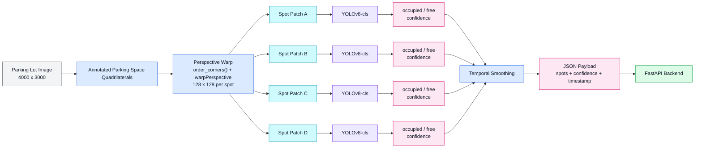
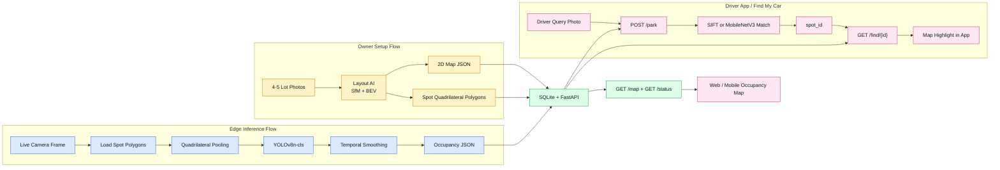

# PRD Diagrams

These diagrams are derived from the canonical PRD in [docs/prd.md](/Users/thebkht/Projects/smart-parking-system/docs/prd.md).

## YOLO Two-Stage Spot Classification

This diagram mirrors the style of the reference image, but matches the actual PRD architecture: quadrilateral pooling followed by per-patch `YOLOv8-cls` inference.

## Product System Overview

This diagram summarizes the three PRD flows: owner setup, edge inference, and driver-facing `Find My Car`.

## Optional Slide Caption

Use this if you want a short caption under the first figure:

> Smart Parking System uses ACPDS quadrilateral pooling to extract one perspective-corrected `128 x 128` patch per parking space, then classifies each patch with `YOLOv8-cls` before temporal smoothing and backend update.
